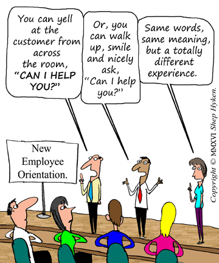

  

## "Java" + "Script" = "JavaScript"?

Though I had seen the word "JavaScript" in my junior year of high school, when I first learned how to program through Java, I haven't actually done any coding with JavaScript until ICS 314. I remember thinking: "Is JavaScript another version of Java? Their names aren't the same, but they both have Java in their names. But if they were the same, why would they have different names?" I never actually looked up the difference between the two languages, but I still somewhat agree with these thoughts that I had two years ago. Most of the syntax is fairly similar, and it seems like it wouldn't take too many changes to translate functioning Java code into JavaScript and vice versa. 

One of the larger differences between the two languages though, seems to be that Java is pretty strict on keeping data types from changing after the declaration, while in JavaScript, we can switch between them! 
