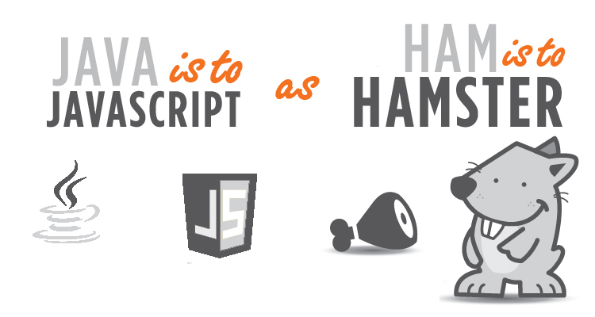

## "Java" + "Script" = "JavaScript"?

Though I had seen the word "JavaScript" in my junior year of high school, when I first learned how to program through Java, I haven't actually done any coding with JavaScript until ICS 314. I remember thinking: "Is JavaScript another version of Java? Their names aren't the same, but they both have Java in their names. But if they were the same, why would they have different names?" I never actually looked up the difference between the two languages, but I still somewhat agree with these thoughts that I had two years ago. Most of the syntax is fairly similar, and it seems like it wouldn't take too many changes to translate functioning Java code into JavaScript and vice versa. 

One of the larger differences between the two languages though, seems to be that Java is pretty strict on keeping data types from changing after the declaration, while in JavaScript, we can switch between them! Although I find assurance in having things as specific as possible, I wasn't necessarily a "fan" of Java until I felt decently comfortable with it, which was towards the end of ICS 211. In my high school Computer Programming class, my teacher would hand out skeleton code for us to implement, and often times, these skeleton codes were a hundred something lines long. JavaScript on the other hand, has so many short cuts! It's almost like coding in Java is the programming equivalent of really wordy writing. I suppose writing out redundant sentences can help one compose a concise sentence, but it's not necessary to do so, and it would take longer to do so.  

Though I think the short cuts in JavaScript are pretty cool, I think that they would make the code harder to debug since several lines of code could be reduced to one. I doubt that, in the workplace, doing things with marginal gains is something that's encouraged, but it is unfortunately something that I find myself doing. 

## The Best of Both Worlds? 

I actually kind of enjoyed doing the practice WODs. Doing a WOD feels like a race against time, and for me, the WOD feels like less of an assignment and more of a competition that I want to win. It was also comforting to know that if I can't solve a problem, I don't need to struggle for an indeterminate amount of time. However, in class, I found myself distracted, wondering how much time was remaining and worrying about the all-or-nothing grading. 

It feels like I am facing a paradox: I want to become better and be able to do things faster without sacrificing quality or accuracy, but I'm afraid that I may mess up because I'm trying to be as quick as I can be. Fortunately and unfortunately, I don't think I have a choice: Athletic software engineering doesn't demand excellence--it requires it. 
