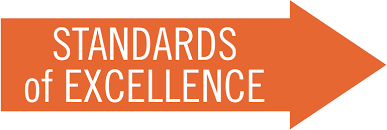

I think there is a reason "programming" is interchangeable with "writing code". The processes of writing code in programming languages and writing text in human languages are actually quite a lot alike. At the surface level, both involve typing, and share a lot of the same terminology such as syntax and grammars. However, and more importantly, programming and writing in natural language both entail continuous revising and improving, much of which is governed by conventions or standards.  

## First Language Framework?
The first language I learned to program in was Java, but the first language that I learned was Korean. Although over thirteen years have passed since I came to the US and learned English, my unedited writing tends to follow the subject-object-verb Korean syntax instead of the subject-verb-object order in English. Similarly, I tend to gravitate towards Java syntax when writing Java*Script* code in ICS 314. Most of the time I spend "writing" isn't so much typing out my ideas but rather restructuring sentences to be more concise, likewise to how a decent chunk of my coding time is making sure parentheses, brackets, and other relevant symbols are where they need to be. 

## ESLint: A "Grammar Check" for JavaScript
However, this isn't to say that lengthy code is bad code. Java is one of the most popular and well known programming languages, and writing a program in Java versus Python or JavaScript, as we are using in ICS 314, is probably going to be longer. With ESLint in JavaScript, having unused variables, functions--anything, really--is going to provoke an error that may prevent the code from running at all. 

Whether it be writing in programming language or a natural language, going though each line forces one to think about what it is meant to do and why it is necessary. It is a pain to do, but the pain is worth the gain. 
