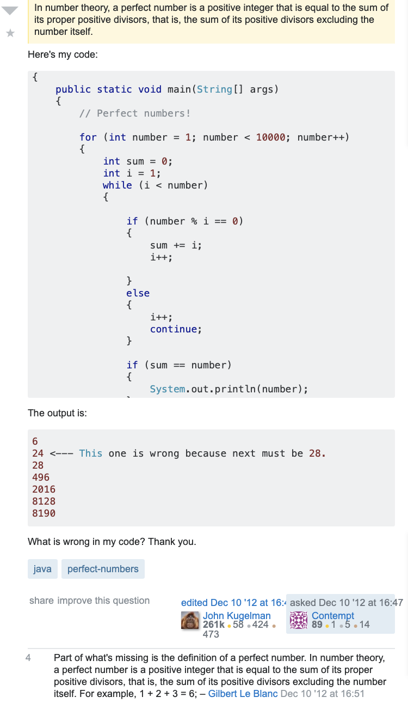
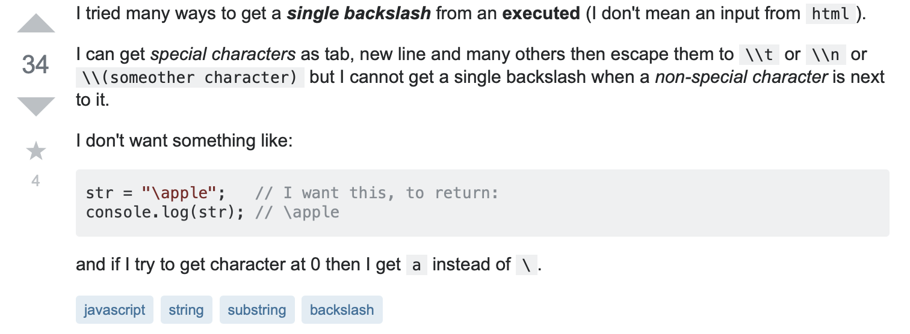

Throughout elementary, middle, and high school, I've had it regurgitated to me that, when we set goals, we should make them S.M.A.R.T., or specific, measurable, attainable, relevant, and timely. These adjectives can also apply to what makes a "question" a "smart question."

Fortunately, in this day and age, software engineers can be "smart" and utilize the Web to quickly get quality responses and solutions to their questions and problems. One of the most common ways to do this is by using Stack Overflow, the computer science branch of Stack Exchange, a question and answer/forum site. The number of questions Stack Overflow hosts goes into the thousands; you wouldn't want your question to get lost! Identifying the specific issue at hand and providing adequate information will increase the chances of getting an answer to your question.

## Everything Given Nothing

One good example of a "not-smart" question is the one in the screenshot below. Although the question asker has provided the code and the output, the inquirer provides no insight into where there might be an issue, and just asks "What's wrong with my code?" The program is to return perfect numbers between one and 1000, and someone suggests providing the definition of a perfect number, which is taken. However, "What is wrong with my code?" could range from something as trivial as a missing semi-colon to an incorrectly written method. Not using camel case could even be considered.

Fortunately for the question asker, two others reply with the same solution that do indeed fix the code. I suppose that because the code being on the less complicated side and well formatted has helped garner responses, but if this were not the case, people may not be as quick or willing to figure out what the code is supposed to do, compared to what it is doing. The code in the screen shot is not commented, and this would make it harder and more time-consuming to resolve the issue.

## The Other Way Around 
A "smart" question is specific, informative, and clear, as evidenced in the backslashes inquiry below. 

The question box even includes information about some things that have been done to correct the issue and and clarification that a reader may find useful. Even with this info, the question isn't long at all! Though this may have to do with the type of question asked, the answers are just as thorough and well-organized as the "smart" question that was asked.
