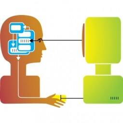

"Computer scientists are only second in laziness to mathematicians."
 
This from a conversation I had with a classmate in ICS 211. I asked him he how finishes most assignments quite quickly, and he told me that he had code from high school to go off of, as well as that computer science people just reuse their code (unless it is necessary to write new code), while mathematicians create new math if things don't fit the math that currently exists. 

## More Work is Inevitable
As a lazy computer science major who would be studying math if she weren't doing CS, I have done the same in looking back at previous materials for a class, hoping to do less work for the assignment I was currently working on. But...I have also done more work while trying to do less work. In my Computational Modeling class, an assignment instructed me to decrypt a message. We had done this by hand in class, counting the number of occurrences for each and all of the 26 letters in the text. None of our counts were completely accurate, and I did not want to do that again, so I decided that I was going to write a program to do it for me. I spent a few hours writing and *trying* to correct 26 if-statements, and I could *literally* not crack the code. It turned out to be that instead of replacing letters by how often they appear, I was supposed to have replaced each letter with one that is seven letters behind it. 

While I may have actually been able to decipher the message and in less time if I *didn't* attempt to code it out, my final project idea for Computational Modeling is, ironically, of the same nature. I am planning to do write code that extracts information from websites, and ICS 314 was actually the inspiration behind it. I often find myself regretting not having looked at the schedule sooner, and although I could set my homepage as the 314 schedule, I would have to click on the links to see what it entails. Furthermore, to view several assignments simultaneously, another window would have to be opened, and I am lazy. 

## Laziness isn't Always Bad
The same principle applies to UI Frameworks like Semantic UI. It seems that what could be done in raw HTML and CSS would be shorter if done with Semantic UI or any other framework: Using HTML and CSS is like writing the code for a delete method when one already exists. The method may potentially not work (like my code!), and others may not understand it. In Semantic UI, much of the code is self explanatory in that the word "menu" is used when creating a menu, and things such as social media logos can be accessed handily. Also, UI Frameworks are standardized, so if an issue were to arise, other team members would be of knowledgeable help. UI Frameworks *are* worth the investment, especially from a software engineering engineering perspective. If something were to be done multiple times, it is lazy to want something else to expedite or automate the process, but this will allow it to be completed sooner.

Although it takes time (and frustration) to learn to use a UI Framework, it's probably better to make the investment earlier than later, to allow for greater efficiency in the long run. 

